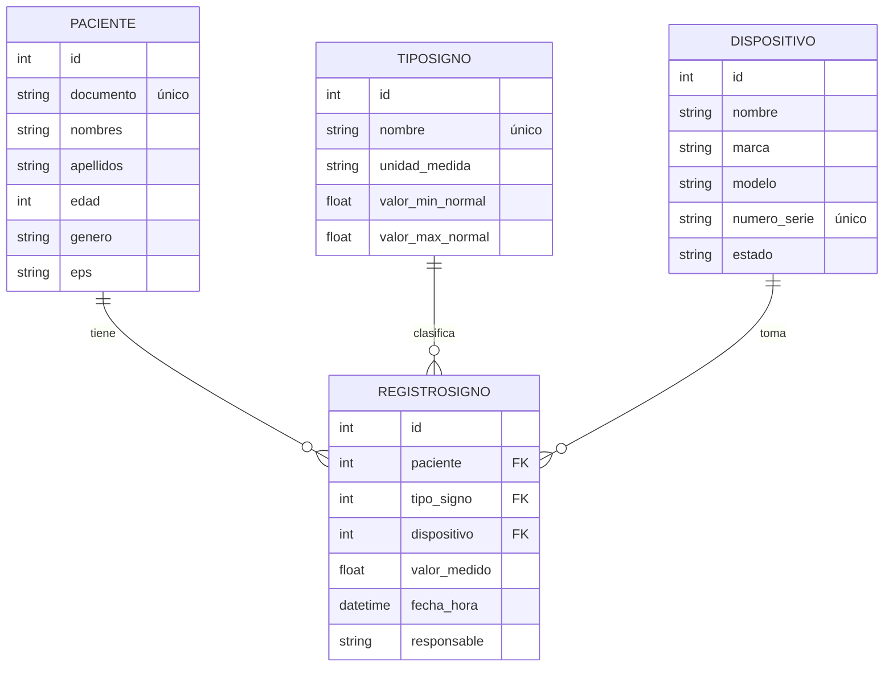

# SMSV – Sistema de Monitoreo de Signos Vitales (API REST)

**Práctica #1 · Ingeniería de Software · Bioingeniería · Universidad de Antioquia · 2026-II**

API REST construida con **Django** y **Django REST Framework (DRF)**, con base de datos **MySQL**. Centraliza la información de pacientes, tipos de signos vitales, dispositivos de medición y los registros que los relacionan. Todas las respuestas son JSON (no se usan plantillas HTML) y CORS está habilitado con `django-cors-headers`, de modo que cualquier interfaz (web, móvil u otro sistema) pueda consumirla.

El repositorio incluye también un frontend de prueba (`index.html`) que consume la API.

## Contenido

1. [Equipo](#equipo)
2. [Tecnologías](#tecnologías)
3. [Estructura del proyecto](#estructura-del-proyecto)
4. [Instalación y ejecución](#instalación-y-ejecución)
5. [Frontend de prueba](#frontend-de-prueba)
6. [Modelo de datos](#modelo-de-datos)
7. [Base de datos precargada](#base-de-datos-precargada)
8. [Endpoints](#endpoints)
9. [Reglas de validación](#reglas-de-validación)
10. [Pruebas](#pruebas)
11. [Flujo de trabajo en Git](#flujo-de-trabajo-en-git)
12. [Solución de problemas](#solución-de-problemas)

---

## Equipo

| Integrante | Recurso | Rama |
| --- | --- | --- |
| Paula Andrea Castaño | Paciente | `feature/paciente` |
| Lizeth Giraldo | TipoSigno | `feature/tipo-signo` |
| Todos | Dispositivo | `feature/dispositivo` |
| Juan Sebastian Castro | RegistroSigno | `feature/registro-signo` |

Cada recurso incluye modelo, migración, serializer, ViewSet y pruebas.

## Tecnologías

| Componente | Uso |
| --- | --- |
| Django 6.1 | Framework del backend |
| Django REST Framework | Serializers, ViewSets y Router |
| MySQL (XAMPP) | Base de datos `bd_grupo_2` |
| PyMySQL | Conector Python ↔ MySQL |
| django-cors-headers | Permite que un frontend en otro puerto consuma la API |
| HTML + JavaScript + Tailwind (CDN) | Frontend de prueba |

Las versiones exactas están en `requirements.txt`.

## Estructura del proyecto

```
repositorio-grupo-2/
├── manage.py
├── requirements.txt
├── index.html                    # Frontend de prueba (consume la API)
├── config/                       # Configuración de Django
│   ├── settings.py               # MySQL, DRF, CORS, zona horaria
│   └── urls.py                   # /admin/ y /api/
└── api/
    ├── models.py                 # Paciente, TipoSigno, Dispositivo, RegistroSigno
    ├── serializers.py            # Validaciones y relaciones anidadas
    ├── views.py                  # ViewSets (CRUD) y filtros
    ├── urls.py                   # Router de DRF
    ├── admin.py
    ├── tests.py                  # Pruebas automáticas
    ├── migrations/
    └── fixtures/
        └── datos_iniciales.json  # Base de datos precargada
```

**Flujo de una petición:** cliente → `config/urls.py` → `api/urls.py` (Router) → ViewSet → Serializer (valida y convierte) → Modelo (ORM) → MySQL, y la respuesta vuelve como JSON.

---

## Instalación y ejecución

**Requisitos:** Python 3.12+, Git y XAMPP (Apache + MySQL).

1. **Clonar el repositorio:**

   ```powershell
   git clone https://github.com/sebastiancastro-lab/repositorio-grupo-2.git
   cd repositorio-grupo-2
   ```

2. **Crear y activar el entorno virtual:**

   ```powershell
   python -m venv venv
   .\venv\Scripts\Activate.ps1
   ```

   Si PowerShell bloquea la activación, ejecuta antes `Set-ExecutionPolicy -Scope Process Bypass`.

3. **Instalar las dependencias:**

   ```powershell
   pip install -r requirements.txt
   ```

4. **Iniciar XAMPP:** abre el panel de control y pulsa *Start* en **Apache** y **MySQL**.

5. **Crear la base de datos:** entra a [phpMyAdmin](http://localhost/phpmyadmin) y crea una base de datos **vacía** llamada exactamente `bd_grupo_2` (cotejamiento `utf8mb4_general_ci`).

6. **Crear las tablas:**

   ```powershell
   python manage.py migrate
   ```

7. **Cargar los datos de ejemplo:**

   ```powershell
   python manage.py loaddata datos_iniciales
   ```

8. **Iniciar el servidor:**

   ```powershell
   python manage.py runserver
   ```

La API queda disponible en **http://127.0.0.1:8000/api/**. Puedes probarla con la interfaz navegable de DRF (abriendo esa URL en el navegador), con Postman o con el frontend de prueba.

La conexión a la base de datos está en `config/settings.py`:

| Parámetro | Valor |
| --- | --- |
| Base de datos | `bd_grupo_2` |
| Usuario | `root` |
| Contraseña | *(vacía)* |
| Host / Puerto | `localhost` / `3306` |

> Si tu MySQL tiene contraseña, cámbiala en `DATABASES['default']['PASSWORD']`.

El panel de administración de Django está en `/admin/` (para usarlo, crea un usuario con `python manage.py createsuperuser`).

---

## Frontend de prueba

`index.html` es una página estática con cuatro pestañas: **Pacientes**, **Tipos de Signo**, **Dispositivos** y **Registros de Signos**. Permite listar, crear, editar y eliminar registros de cada recurso. En Registros muestra el estado de cada medición (🟢 Normal, 🟡 Bajo, 🔴 Alto) a partir del campo calculado `estado_valor` de la API, y al registrar solo permite elegir dispositivos activos.

Con el servidor de Django en marcha, ábrelo de cualquiera de estas formas:

- Haciendo doble clic sobre `index.html`.
- O desde otra terminal, en la carpeta del proyecto:

  ```powershell
  python -m http.server 5500
  ```

  y entrando a http://127.0.0.1:5500/index.html

La interfaz usa Tailwind desde su CDN, así que necesita conexión a internet. La API se consulta en `http://127.0.0.1:8000/api` (constante `API_URL` en `index.html`).

---

## Modelo de datos



`RegistroSigno` es el recurso relacional: referencia a los otros tres con claves foráneas `PROTECT`, por lo que no se puede borrar un paciente, un tipo de signo o un dispositivo que ya tenga mediciones. Así se evita perder historial clínico en cascada.

## Base de datos precargada

El archivo `api/fixtures/datos_iniciales.json` contiene:

| Recurso | Cantidad | Detalle |
| --- | --- | --- |
| Pacientes | 5 | |
| Tipos de signo | 4 | Frecuencia Cardíaca, Presión Arterial Sistólica, Temperatura Corporal, Saturación de Oxígeno |
| Dispositivos | 4 | 3 activos y 1 en mantenimiento |
| Registros de signos | 14 | Incluye valores normales, altos y bajos |

Se carga con `python manage.py loaddata datos_iniciales` sobre una base de datos recién migrada. Usa ids fijos: si ya existen filas con los mismos ids, se sobrescriben.

> Git guarda el código, no el contenido de tu base de datos. Por eso cada integrante debe ejecutar `migrate` y `loaddata` en su propio XAMPP.

---

## Endpoints

Prefijo común: `http://127.0.0.1:8000/api`. Cada recurso tiene CRUD completo mediante un ViewSet registrado en un `DefaultRouter`. La raíz `/api/` muestra la interfaz navegable de DRF con los cuatro recursos.

### Pacientes

| Método | URL | Descripción |
| --- | --- | --- |
| GET | `/api/pacientes/` | Lista todos los pacientes |
| POST | `/api/pacientes/` | Crea un paciente |
| GET | `/api/pacientes/{id}/` | Detalle de un paciente |
| PUT | `/api/pacientes/{id}/` | Actualiza un paciente (todos los campos) |
| PATCH | `/api/pacientes/{id}/` | Actualiza parcialmente un paciente |
| DELETE | `/api/pacientes/{id}/` | Elimina un paciente (409 si tiene registros asociados) |

### Tipos de signo

| Método | URL | Descripción |
| --- | --- | --- |
| GET | `/api/tipos-signo/` | Lista el catálogo de signos vitales |
| POST | `/api/tipos-signo/` | Crea un tipo de signo (nombre único; mínimo < máximo) |
| GET | `/api/tipos-signo/{id}/` | Detalle de un tipo de signo |
| PUT | `/api/tipos-signo/{id}/` | Actualiza un tipo de signo (todos los campos) |
| PATCH | `/api/tipos-signo/{id}/` | Actualiza parcialmente un tipo de signo |
| DELETE | `/api/tipos-signo/{id}/` | Elimina un tipo de signo (409 si tiene registros asociados) |

### Dispositivos

| Método | URL | Descripción |
| --- | --- | --- |
| GET | `/api/dispositivos/` | Lista dispositivos. Filtro opcional: `?estado=activo` |
| POST | `/api/dispositivos/` | Crea un dispositivo (`numero_serie` único; `estado` válido) |
| GET | `/api/dispositivos/{id}/` | Detalle de un dispositivo |
| PUT | `/api/dispositivos/{id}/` | Actualiza un dispositivo (todos los campos) |
| PATCH | `/api/dispositivos/{id}/` | Actualiza parcialmente (por ejemplo, cambiar el estado) |
| DELETE | `/api/dispositivos/{id}/` | Elimina un dispositivo (409 si tiene registros asociados) |

Estados permitidos: `activo`, `en mantenimiento`, `fuera de servicio`.

### Registros de signos

| Método | URL | Descripción |
| --- | --- | --- |
| GET | `/api/registros/` | Lista registros con paciente, tipo de signo y dispositivo anidados. Filtros opcionales: `?paciente=1&tipo_signo=2&dispositivo=3` |
| POST | `/api/registros/` | Crea un registro (el dispositivo debe estar `activo`) |
| GET | `/api/registros/{id}/` | Detalle de un registro |
| PUT | `/api/registros/{id}/` | Actualiza un registro (todos los campos) |
| PATCH | `/api/registros/{id}/` | Actualiza parcialmente un registro |
| DELETE | `/api/registros/{id}/` | Elimina un registro |

**Ejemplo `POST /api/registros/`**

```json
{
  "paciente": 1,
  "tipo_signo": 1,
  "dispositivo": 1,
  "valor_medido": 78,
  "responsable": "Enf. Carolina Restrepo"
}
```

`fecha_hora` es opcional (si no se envía, se usa la fecha y hora actual) y no puede estar en el futuro.

**Ejemplo de respuesta** (la información de las relaciones va incluida):

```json
{
  "id": 14,
  "paciente": 5,
  "paciente_detalle": { "id": 5, "documento": "43876210", "nombres": "Gloria Inés", "apellidos": "Vélez Zapata", "edad": 72, "genero": "Femenino", "eps": "Compensar" },
  "tipo_signo": 3,
  "tipo_signo_detalle": { "id": 3, "nombre": "Temperatura Corporal", "unidad_medida": "°C", "valor_min_normal": 36.1, "valor_max_normal": 37.2 },
  "dispositivo": 3,
  "dispositivo_detalle": { "id": 3, "nombre": "Termómetro infrarrojo", "marca": "Braun", "modelo": "ThermoScan 7", "numero_serie": "BR-IRT6520-0310", "estado": "activo" },
  "valor_medido": 36.4,
  "estado_valor": "normal",
  "fecha_hora": "2026-10-01T06:50:00-05:00",
  "responsable": "Enf. Julián Osorio"
}
```

`estado_valor` es un campo calculado: `bajo`, `normal` o `alto`, según el rango normal del tipo de signo.

### Códigos de respuesta

| Código | Significado |
| --- | --- |
| 200 OK | Consulta o actualización exitosa |
| 201 Created | Recurso creado |
| 204 No Content | Recurso eliminado |
| 400 Bad Request | Datos inválidos (falló una validación) |
| 404 Not Found | El recurso no existe |
| 409 Conflict | No se puede eliminar porque tiene registros de signos asociados |

---

## Reglas de validación

| Recurso | Regla | Respuesta |
| --- | --- | --- |
| TipoSigno | `nombre` único; `valor_min_normal` < `valor_max_normal` | 400 |
| Dispositivo | `numero_serie` único; `estado` ∈ {activo, en mantenimiento, fuera de servicio} | 400 |
| RegistroSigno | Dispositivo `activo` al crear o al cambiar de dispositivo | 400 |
| RegistroSigno | `valor_medido` ≥ 0, `fecha_hora` no futura, `responsable` obligatorio | 400 |
| Paciente / TipoSigno / Dispositivo | No se pueden eliminar si tienen registros de signos asociados (protege el historial) | 409 |

Cuando una validación falla, la API responde con el mensaje de error en JSON.

## Pruebas

```powershell
python manage.py test
```

Para ejecutar solo las de un recurso:

```powershell
python manage.py test api.tests.TipoSignoTests
python manage.py test api.tests.DispositivoTests
python manage.py test api.tests.RegistroSignoTests
```

Django crea una base de datos temporal `test_bd_grupo_2` en MySQL y la elimina al terminar. Las pruebas cubren el CRUD de TipoSigno, Dispositivo y RegistroSigno, las validaciones anteriores, las relaciones anidadas, los filtros, la protección contra borrado y que la base precargada cumpla el mínimo del enunciado (32 pruebas en total).

---

## Flujo de trabajo en Git

Nadie trabaja directamente sobre `main`. Cada integrante usa su propia rama:

```powershell
git checkout main
git pull origin main
git checkout -b feature/nombre-de-su-tarea
# ... cambios ...
git add .
git commit -m "feat: descripción del cambio"
git push origin feature/nombre-de-su-tarea
```

Luego se abre un **Pull Request** en GitHub hacia `main`, para que otro compañero revise el código antes de fusionarlo.

Cada integrante modifica solo los archivos de su recurso dentro de `api/`:

| Tarea | Archivo |
| --- | --- |
| Campos y relaciones | `api/models.py` |
| Validaciones | `api/serializers.py` |
| Filtros y lógica de los endpoints | `api/views.py` |
| Rutas | `api/urls.py` |

Cada vez que alguien modifique `api/models.py`, debe ejecutar localmente `python manage.py makemigrations` y `python manage.py migrate`, y avisar al equipo antes de subir una migración nueva para evitar conflictos.

---

## Solución de problemas

**`Can't connect to MySQL server on 'localhost'` (WinError 10061)**
MySQL no está iniciado. Abre XAMPP y pulsa *Start* en MySQL. Si no queda en verde, revisa *Logs*: puede haber otro MySQL usando el puerto 3306.

**`Unknown database 'bd_grupo_2'`**
Falta crear la base de datos. Créala vacía en phpMyAdmin con ese nombre exacto.

**`migrate` falla con errores como `Can't DROP COLUMN` o `table already exists`**
La base quedó a medias por un intento anterior (MySQL no revierte cambios de estructura cuando una migración falla). Recréala vacía desde la pestaña *SQL* de phpMyAdmin y repite los pasos 6 y 7:

```sql
DROP DATABASE IF EXISTS bd_grupo_2;
CREATE DATABASE bd_grupo_2 CHARACTER SET utf8mb4 COLLATE utf8mb4_general_ci;
```

**Las listas salen vacías o no aparecen los datos de ejemplo**
La base de datos no viaja con Git. Ejecuta `python manage.py migrate` y luego `python manage.py loaddata datos_iniciales`.

**El frontend no muestra datos**
Verifica que `python manage.py runserver` esté activo y que http://127.0.0.1:8000/api/ responda.

**El frontend se ve distinto o sin estilos**
Revisa que tengas internet (Tailwind se carga por CDN), recarga con `Ctrl + F5` y confirma que estás en la última versión de `main` con `git checkout main` y `git pull origin main`.

**Cambié un modelo y la base no se actualiza**
Ejecuta `python manage.py makemigrations` y luego `python manage.py migrate`.
